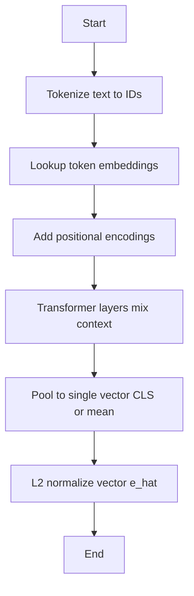
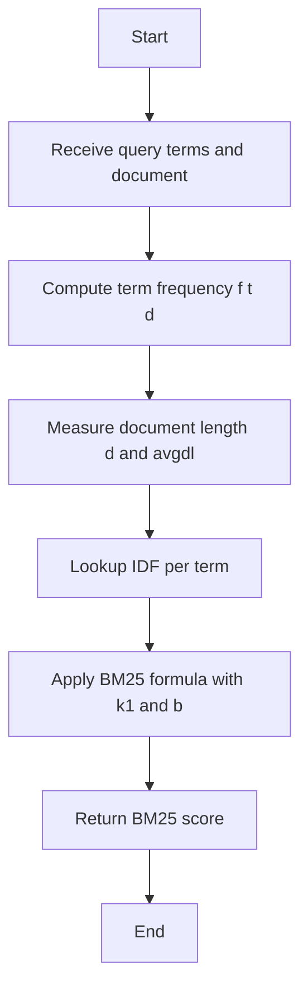
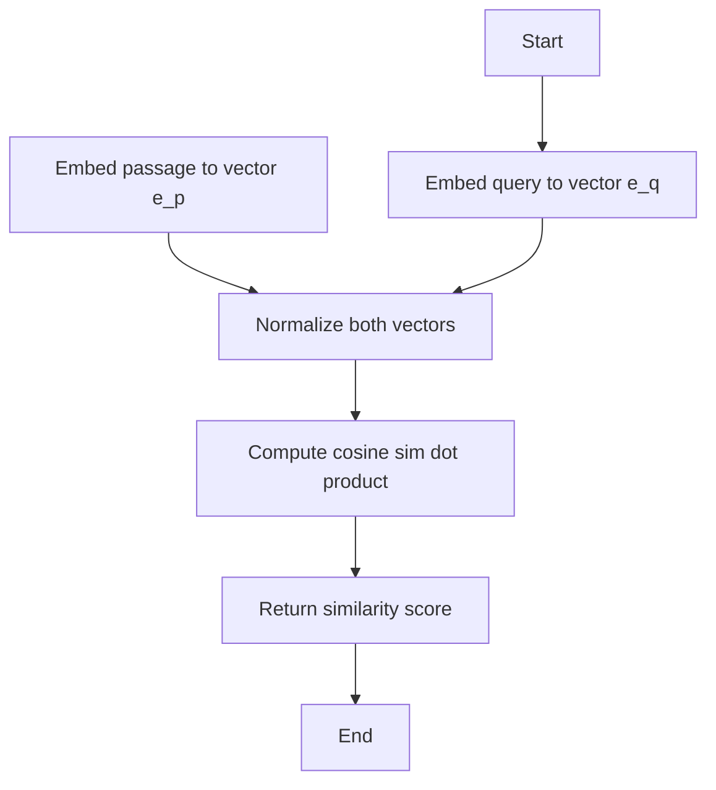
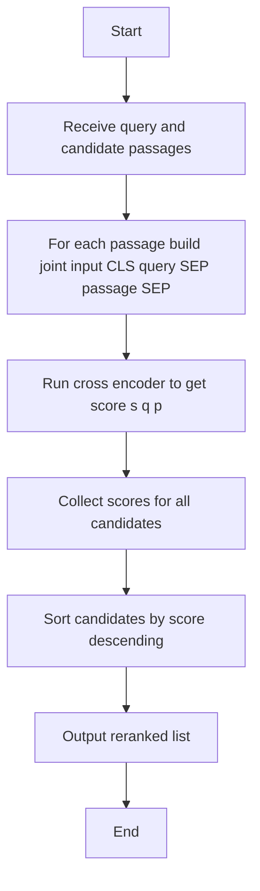
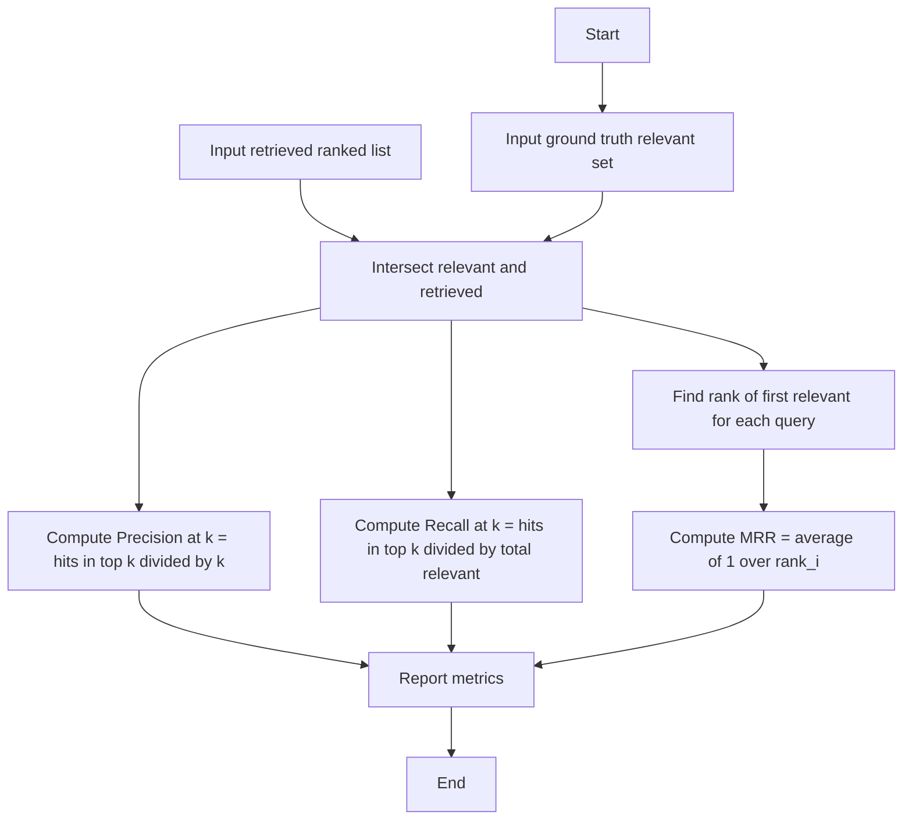

## Embedding (text to vector)


## Lexical scorer (BM25)


## Dense retriever (cosine similarity)


## Hybrid fusion (lexical + dense)
```mermaid
flowchart TD
  A[Start] --> B[Input normalized BM25 score]
  A2[Input normalized cosine score] --> C
  B --> C{Blend with alpha}
  C --> D[score_hybrid = alpha * BM25_norm + (1 - alpha) * sim_norm]
  D --> E[Return fused score]
  E --> F[End]
```

## Cross encoder reranker


## Evaluation metrics

